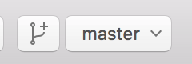
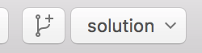
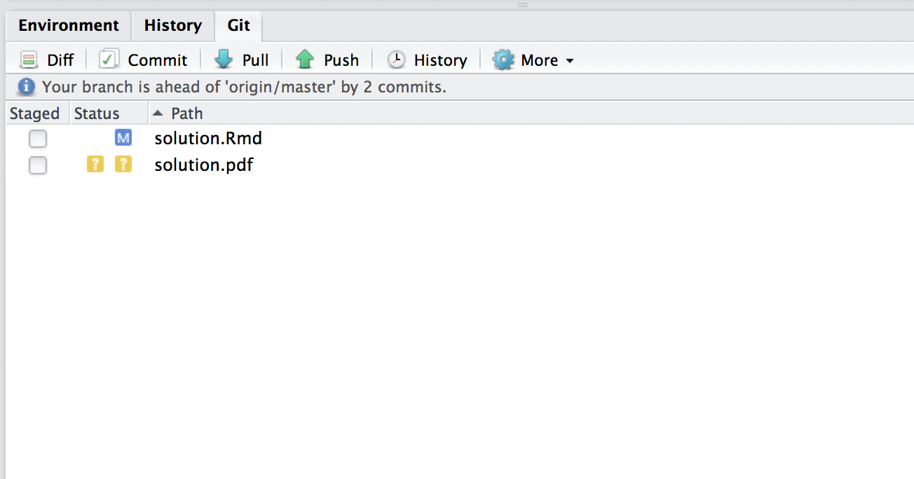

# Overview

## Purpose {-}

The purpose of this assignment is twofold.

1. To check if your environment for computation and writing is up and running; and
2. To become familiar with GitHub workflow.

In this document, I will use a lot of functionalities of **Rmarkdown** [@R-rmarkdown], **knitr** [@R-knitr] and **bookdown** [@R-bookdown] to demonstrate that you can write full academic papers with Rmarkdown. You don't need to understand all the details behind the scene now. After a bit of struggle with R, Rmarkdown and LaTeX, you will be able to tweak this source file to write your own paper. 

## In a nutshell {-}

In this assignment, you will

- clone the assignment repository;
- make a working branch;
- replicate the present PDF file with your name on the author line; and
- commit the change and open a Pull Request.
 
# Prerequisite

## GitHub Account {-}

Make a github account if you don't have one.

- [GitHub](https://github.com/)

## Softwares {-}

Please install the following softwares (they are free)

- R 
- RStudio
- LaTeX system ([texlive for Windows/Linux](https://www.tug.org/texlive/), 
  [MacTeX for macOS](https://tug.org/mactex/))
- [GitHub Desktop](https://desktop.github.com/)

When you finish installation, follow the instructions below.

# Instructions

## Step 1. Clone the assignment repository {-}

1. Click the invitation link you've got from the lecturer or TA. 
2. Accept the invitation and then your assignment repository is automatically created. 
3. Go to the repository that GitHub Classroom has made for you.
4. Click the green button saying "Clone or download" and then click "Open in Desktop". 

Then GitHub Desktop will open.

## Step 2. Make a new branch with a descriptive name {-}

DO NOT start working on the problem yet! In GitHub Desktop, you should see 
something like Figure \@ref(fig:master-branch). It says that you are on the 
`master` branch, which is the default branch. 

```{r, master-branch, fig.align='center', fig.cap='master branch', echo=FALSE}

```

Make a new branch with a descriptive name by clicking the button with the branch-shaped 
picture. Let's name the new branch as "`solution`". 

Wait a minute. What is a branch? A branch corresponds to a "line of development." You may want to divert from the main line of development (`master` branch) to do some experiments. 
If the experiments turn out to be unsuccessful, you can discard the experimental branch
without affecting the `master` branch. If they are successful, on the other hand,
you can make the `master` branch `merge` the experimental branch to be a part of the 
main line of development. Branches are particularly useful when you work on a team. 
You can share your experiments, without affecting other members' work.

When you are on a branch you create, you should see something like 
Figure \@ref(fig:solution-branch) on the GitHub Desktop application.

```{r, solution-branch, fig.align='center', fig.cap='solution branch', echo=FALSE}

```

## Step 3. Open the assignment directory by RStudio {-}

Then open the folder (`hw01`) in which the repository resides, by 

- [Windows] Clicking the gear button and then "Open in Explorer"
- [Mac] Right-Clicking (Two-finger click) on the repository name in the left area, 
  and then clicking "Open in Finder"

Double click `hw01.Rproj` file. RStudio will open. 

## Step 4. Open this assignment file {-}

Look at the "Files" pane on RStudio, where you can find "solution.Rmd". 
Click it and now you see the source file of this instruction manual. 


## Step 5. Knit and become friends with errors {-}

Click "knit" button above the editor pane (Figure \@ref(fig:knit-button)). 
If this is the first time you try to knit Rmd file, you are prompted to install and/or 
update dependencies. 

```{r, knit-button, fig.align='center', fig.cap='knit button', echo=FALSE}
knitr::include_graphics("asset/images/knit.png")
```

Success? Now, do you see a PDF file named `solution.pdf`? Everything seems to be okay? 
Congratulations, you are good to go!

If you don't see the PDF, hang in there. Since this is a common case, don't be ashamed of having caused an error. As you learn how to code, you'll encounter even more error messages (not less!!).

What you need to do is read the error message carefully. Try to figure out what caused it. After a careful reading of error message, you sometimes can fix it by yourself. But not always. If you still don't know what to do, copy the error message and ask google about that. If you still can't fix, ask the TA or lecturer. 

**IMPORTANT!!!** Don't ask us an "I can't compile... something went wrong" kind of vague question. Be an error handling machine and ask this way, "I did ... expecting to get ... but I got an error message instead saying (this and that)... I will send the whole error message to you. Do you know how to get rid of it?"

Your problem was probably caused by missing packages? As a matter of fact, this Rmd depends on not-preinstalled package called **tidyverse** [@R-tidyverse] and **bookdown** [@R-bookdown]. Please install them by running the following command in the console pane.

```{r, eval=FALSE}
install.packages("bookdown")
install.packages("tidyverse")
```

`install.packages("package_name")` is a typical way of installing packages on R.

## Step 6. Make modification {-}

You may want to modify the source because the output PDF file has a strange author 
name on it: "Your name". Find the way to change the author name. Put your name there.

Save the file and knit again.

## Step 7. Commit {-}

Find the Git pane. After the modification and knitting, it should look like 
Figure \@ref(fig:git-pane).

```{r, git-pane, echo=FALSE, fig.align='center', fig.cap='Git pane', out.width="300px"}

```

Stage `solution.Rmd` and `solution.pdf` by checking the box on the left
of the file names. This corresponds to the git command `git-add`.^[See https://www.atlassian.com/git/tutorials/saving-changes]

Then click "Commit button." A new window will open and you will be requested to write a commit message. Write a short description of what you did and why. Click "Commit" button when finished.


## Step 8. Open a Pull Request {-}

Let's go back to GitHub Desktop application. Find the homework repository on the left column. The History tab shows what you did. Check that every change you are supposed to make is highlighted by green (addition) and red (deletion). 

```{r, pull-request, fig.align='center', fig.cap='Pull Request', echo=FALSE}
knitr::include_graphics("asset/images/pull-request.png")
```

Click "Pull Request" button (Figure \@ref(fig:pull-request)), write a short nice description and click "Send Pull Request."

Congratulations, you are done!

In the rest of the handout, I show you what you can do with R and Rmarkdown. 

# Example: R code and output in a document

```{r}
library(tidyverse)
(iris_tbl <- as_data_frame(iris))
```

The raw output of R is not very beautiful for PDF. You probably want to use `knitr::kable()` function to print a table. Table \@ref(tab:iris-print) is produced by the following code.

```{r iris-print}
knitr::kable(head(iris_tbl, 10), caption = "Iris dataset")
```

The following code generates and print Figure \@ref(fig:iris).^[See http://stackoverflow.com/questions/38861041/knitr-rmarkdown-latex-how-to-cross-reference-figures-and-tables/38884378#38884378]

```{r iris, fig.cap="Iris Data", fig.align='center', fig.width=4, fig.height=3}
ggplot(iris_tbl) + 
  geom_point(aes(x = Sepal.Length, y = Petal.Length, color = Species)) 
```


# Example: Mathematical expressions using LaTeX

You can produce mathematical equations using LaTeX syntax: 

\begin{equation}
f(x) = f(0) + \int_0^x f'(y) dy.  (\#eq:ftc)
\end{equation}


Cross reference works like Equation \@ref(eq:ftc) but the syntactic rule is different from LaTeX. 
See [https://bookdown.org/yihui/bookdown/markdown-extensions-by-bookdown.html#equations](https://bookdown.org/yihui/bookdown/markdown-extensions-by-bookdown.html#equations) for more detail.


# References {-}

```{r include=FALSE}
# automatically create a bib database for R packages
knitr::write_bib(c(.packages(), 'bookdown', 'knitr', 'rmarkdown'), 'asset/bib/packages.bib')
```

